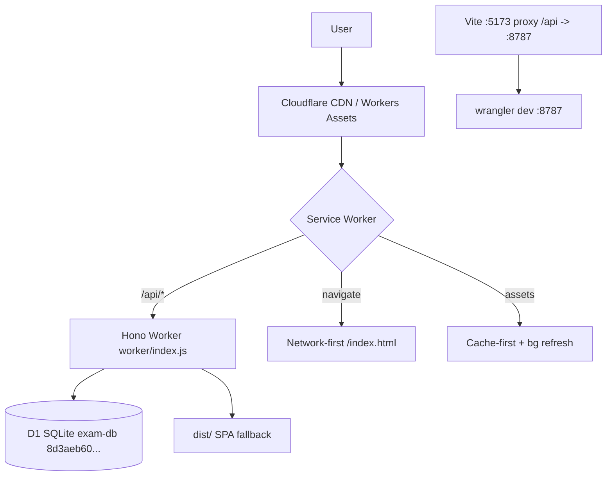
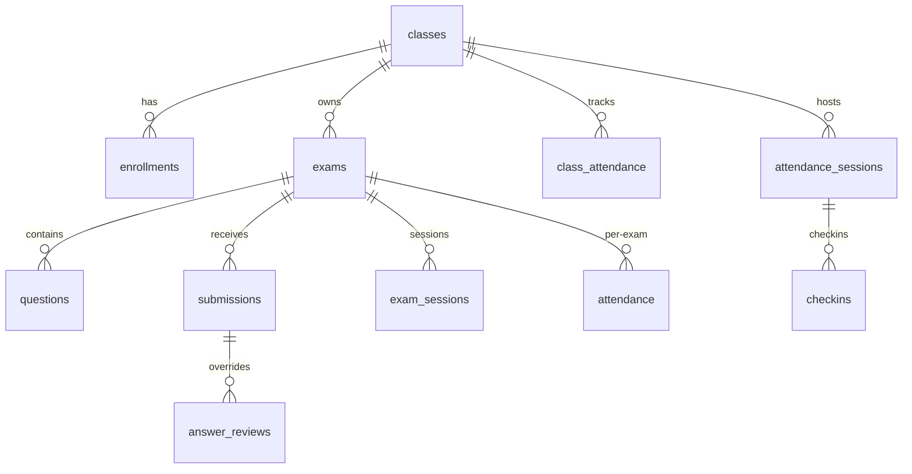
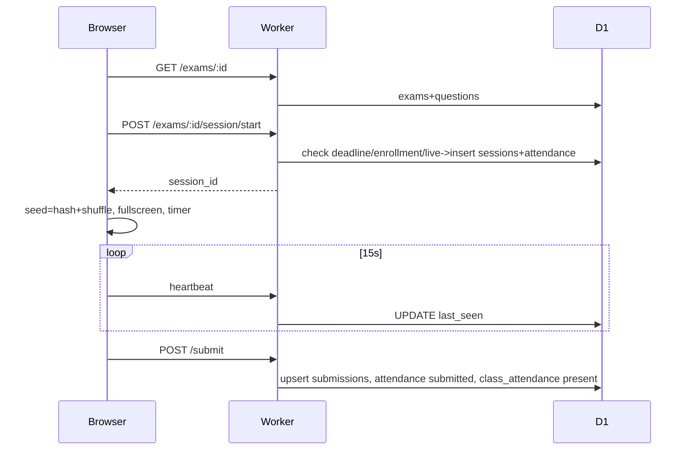

# WMSU Exam System — Full Architecture Documentation

> **Project:** WMSU Exam Portal (Western Mindanao State University) | **Version:** 1.0.0 | **Date:** 2026-08-22
> **Stack:** React 18 + Vite 5 + Tailwind 4 + Hono 4 + Cloudflare Workers + D1 (SQLite) + PWA

---

## Table of Contents
- 1. Executive Summary
- 2. Technology Stack
- 3. Project Structure
- 4. Deployment & Runtime
- 5. Frontend
- 6. Backend
- 7. Data
- 8. Workflows
- 9. Cross-Cutting
- 10. Build & Deploy
- 11. Config
- 12. Security

## 1. Executive Summary

WMSU Exam System is a **single-Worker examination, attendance, and class-management platform** on **Cloudflare** (Workers + D1 + Assets). Serves **Students** (public: enroll via class codes, QR check-in, randomized proctored exams offline-resilient, leaderboard, records) and **Instructors/Admins** (manage classes, create exams, question bank, live proctoring, review/regrade, analytics, logs).

Goals: zero servers to maintain, deterministic per-student randomization (cheat-resistant), offline-first exams, single-session lock + heartbeat anti-cheating, dual attendance model.

---

## 2. Technology Stack

| Layer | Tech | Version | Purpose | Config |
|-------|------|---------|---------|--------|
| Frontend | React | ^18.3.1 | SPA | src/main.jsx:1 |
| Routing | React Router DOM | ^6.26.0 | | src/App.jsx:1 |
| Build | Vite | ^5.4.0 | | vite.config.js:5 |
| Styling | Tailwind | ^4.3.3 @tailwindcss/vite | tokens: src/styles/tokens.css |
| Icons | lucide-react | ^1.21.0 | | |
| QR | qrcode | ^1.5.4 | admin QR | |
| Backend | Hono | ^4.12.27 | worker/index.js:1 | |
| Runtime | Cloudflare Workers | compat 2025-04-01 | wrangler.toml:3 | |
| DB | Cloudflare D1 (SQLite) | — | 12 tables | worker/schema.sql:1 |
| Assets | Workers Assets | dist/ | SPA fallback | wrangler.toml:4 |
| PWA | SW + Manifest | — | public/sw.js:1, manifest.webmanifest:1 | |
| Package | pnpm | — | package.json:21 | |

## 3. Project Structure

```
exam-system/
├── worker/index.js           # Hono app ~1615 LOC, ~40 routes
├── worker/schema.sql         # 12 tables + 10 indexes
├── worker/migration_*.sql    # classes, attendance, sessions, submit_reason
├── src/main.jsx              # createRoot + BrowserRouter + SW register:12
├── src/App.jsx               # 16 routes:21
├── src/api.js                # 38 helpers, 88 LOC, BASE api.js:1
├── src/utils.js              # seededRandom, shuffleWithSeed, matchesAnswer 297 LOC
├── src/styles/ tokens.css, base.css, components.css
├── src/components/AdminLayout.jsx:158, AuthGate.jsx:8, PublicLayout.jsx, QuestionCard.jsx, Timer.jsx, Toast.jsx, FloatingInstall.jsx
├── src/components/ui/ Button, Card, Badge, Modal, Table, Field, StatCard, PageHeader, Spinner, ConfirmDialog
├── src/pages/Landing.jsx, Exam.jsx:13 (901 LOC), Checkin.jsx, StudentEnroll.jsx, StudentRecords.jsx, Leaderboard.jsx
├── src/pages/admin/ Dashboard, CreateExam, Classes, QuestionBank, Answers, Results, Proctor, Preview, Regrade, ActivityLog
├── public/sw.js:1 (v2), manifest.webmanifest:1, icons/
├── vite.config.js:5, wrangler.toml:1, package.json:7
└── dist/ (build output) + backups/ + scripts/
```

## 4. Deployment & Runtime Architecture



* **Single Worker** wrangler.toml:1-4: name=exam-system, main=worker/index.js, assets dir=dist, SPA fallback.
* **D1** wrangler.toml:9-12: binding DB, database_name exam-db, id 8d3aeb60-107e-41df-a235-ae63391afe94.
* **Dev**: pnpm dev (5173) proxies /api to 8787 (vite.config.js:10). Run both.
* **Deploy**: pnpm run deploy:worker (wrangler deploy) vs deploy:pages (build + pages deploy) package.json:10-11. Pages auto-deploy on main; Worker needs explicit CLI_REFERENCE.md:14.
* **PWA**: src/main.jsx:12 registers SW only in PROD; public/sw.js:26 bypasses /api, navigate fallback to /index.html.

## 5. Frontend Architecture

### 5.1 Routing — src/App.jsx:21

| Path | Component | Layout | Auth |
|------|-----------|--------|------|
| / | Landing | PublicLayout | public |
| /exam?id= | Exam | custom | public (session lock) |
| /checkin | Checkin | PublicLayout | public |
| /enroll | StudentEnroll | PublicLayout | public |
| /records | StudentRecords | PublicLayout | public |
| /leaderboard | Leaderboard | PublicLayout | public |
| /admin | Dashboard | AdminLayout+AuthGate | admin |
| /admin/create | CreateExam | AdminLayout | admin |
| /admin/classes | Classes | AdminLayout | admin |
| /admin/bank | QuestionBank | AdminLayout | admin |
| /admin/answers, /admin/results, /admin/preview, /admin/regrade, /admin/proctor, /admin/logs | | AdminLayout | admin |

ToastProvider + FloatingInstall globally (App.jsx:42).

### 5.2 Layouts

* **PublicLayout**: header + outlet + footer.
* **AdminLayout** src/components/AdminLayout.jsx:158: mobile drawer (translate) + desktop collapsible w-60<->w-16. Nav groups :10-43: Overview, Classes, Exams (Bank/Answers/Regrade), Monitoring (Proctor), System (Logs). UserMenu :115 logout clears sessionStorage.admin_auth.
* **AuthGate** src/components/AuthGate.jsx:8: VITE_ADMIN_PASSWORD || admin123, sessionStorage check, 400ms delay, Lock UI.

### 5.3 API Layer — src/api.js:1

BASE = VITE_API_URL || /api (api.js:1). request() :3 fetch->text->JSON guard, e.status. adminPass() :23 env pwd as Authorization header. 38 helpers: exams, questions, bank, submissions/leaderboard/analytics, logs, sessions/heartbeat/proctor/retry, attendance-sessions, classes/enrollments, class attendance, records.

### 5.4 Utilities — src/utils.js:1

* seededRandom :1 LCG s=(1664525*s+1013904223)&0xffffffff; hashStr :9 poly 31; shuffleWithSeed :15 Fisher-Yates; renderDatasets :25 {{DATA:...}} shuffle per qIdx*31337+99991 (en-PH).
* **Fill-blank engine** utils.js:37 mirrored worker/index.js:1236: 1) canonicalize :72 (unicode −→-, ×→*, ÷→/, ²→^n, √→sqrt, π→pi, strip ws, strip x=, insert *), 2) numericCompare :221 evalTokens+almostEqual REL 1e-6 ABS 1e-9, 3) sampleCompare :247 same vars → 18+24 points need >=8 valid, 4) sortFactors :279. matchesAnswer :283.

### 5.5 Key Pages

* **Landing** Landing.jsx:7 hero navy gradient, exam ID -> /exam?id.
* **Exam** Exam.jsx:13 901 LOC: fetch exam + cached_exam fallback, gate (lookupStudent for class-linked), startSession -> seed=hash(name+section+id) -> shuffle questions + choices seed+qIdx*7919 -> fullscreen+timer -> visibility/blur/resize heartbeat 15s -> client grade matchesAnswer -> POST /submit queue pending_submission on offline.
* **Checkin/Enroll/Records/Leaderboard**: thin wrappers.

### 5.6 UI System

Tokens tokens.css vars, base.css/components.css .input/.btn/.card. ui/ primitives Button/Card/Badge/Modal/Table/Field/StatCard/PageHeader/Spinner/ConfirmDialog. QuestionCard MCQ shuffled displayKeys vs fill_blank input.

### 5.7 PWA & Offline

Manifest manifest.webmanifest:1 fullscreen #0f2044 3 icons. SW sw.js:1 exam-portal-v2 SHELL [/ , /index.html] install skipWaiting, activate cleanup. Fetch bypass non-GET/cross-origin/api. Exam localStorage: cached_exam_, exam_state_, pending_submission_, WifiOff banner.

## 6. Backend Architecture (Worker)

### 6.1 Entry — worker/index.js:1

Hono + cors: app.use("/api/*", cors()); export default app. No global auth; per-route adminCheck(c) :34 compares Authorization to c.env.VITE_ADMIN_PASSWORD || admin123. Helpers: uuid :8 crypto.randomUUID, genCode :11 6-char CODE_CHARS, uniqueClassCode :17 25 tries, log :26 activity_log.

### 6.2 Routes

| Group | Method | Auth | Source |
|-------|--------|------|--------|
| Exams | GET /api/exams | — | :41 counts |
| | POST /api/exams | — | :52 |
| | GET /api/exams/:id | soft hide roster/code | :64 |
| | PUT /api/exams/:id | — | :86 |
| | DELETE /api/exams/:id | — | :99 |
| | GET retry-status | — | :109 |
| | GET student lookup | — | :126 |
| Questions | POST /exams/:examId/questions | — | :148 |
| | PUT /questions/:id | — | :161 |
| | DELETE /questions/:id | — | :171 |
| | POST bulk | — | :178 |
| Bank | GET /api/bank | — | :199 |
| | POST/PUT/DELETE bank | admin | :207/221/233 |
| Logs | GET /api/logs | — last 200 | :242 |
| Submit | POST /api/submit | — deadline/enrollment/resubmit + attendance+class_attendance | :251 |
| Submissions | GET /api/submissions/:examId | — +reviews | :1116 |
| | POST review | admin | :1524 computeScore |
| | POST regrade | admin | :1568 |
| | GET leaderboard | — top100 | :1105 |
| | GET analytics | — per-Q stats | :1138 |
| Sessions | POST session/start | — 75s lock | :327 |
| | POST heartbeat | — | :407 |
| | POST end | — | :427 |
| Proctor | GET /proctor/:examId | admin active/stale/kicked | :440 |
| | POST kick | admin | :477 |
| | POST retry | admin | :501 |
| Exam Att | GET /exams/:examId/attendance | admin | :520 |
| Att Sessions | GET /attendance-sessions | admin | :571 |
| | POST/PUT/DELETE | admin | :581/595/607 |
| | GET :id public | — | :616 |
| | POST lookup | — | :630 |
| | POST :id/checkin | — dup guard | :642 |
| | GET :id/report | admin | :689 |
| Classes | GET /classes | admin | :730 |
| | POST /classes | admin auto code | :742 |
| | PUT/DELETE | admin | :757/771 |
| | GET :id detail | admin | :825 |
| | GET code/:code public | — | :780 |
| | POST enroll self | — | :788 |
| | POST :id/enroll bulk | admin | :846 |
| | PUT/DELETE enroll | admin | :879/869 |
| | GET /students | admin | :935 |
| Class Att | GET attendance?date | admin | :954 |
| | POST attendance | admin | :980 |
| | GET history | admin | :1002 |
| Records | GET /student/:studentId | — | :1048 |

SESSION_STALE_MS=75_000 :325. computeScore :1490 duplicated from utils.js.

## 7. Data Architecture

### 7.1 ER Diagram



### 7.2 Tables — worker/schema.sql:1

| Table | PK | Columns | Notes |
|-------|----|---------|-------|
| exams | id | title, description, time_limit d60, questions_per_set d10, show_answers d1, deadline, access_code, roster JSON, class_id | roster legacy if class_id empty |
| questions | id | exam_id FK CASCADE, part INT, text, type d multiple_choice (fill_blank), choices JSON [{key,text}], answer, explain, sort_order | |
| submissions | id | exam_id FK, student_name/section/id, seed, answers JSON qId->displayKey, score, total, tab_switches, time_taken, reason manual/timeout/tab/kick, retry_allowed | unique (exam_id, student_name, student_section) |
| question_bank | id | part, text, type, choices, answer, explain | reusable |
| activity_log | id | action, details, admin_name | append-only 200 |
| answer_reviews | (submission_id, question_id) | verdict correct/incorrect | override |
| exam_sessions | id | exam_id FK, student_id/name/section, device_id, tab_switches, started_at, last_seen, active d1, kicked d0 | live |
| attendance | id | exam_id FK, student_id/name/section, status checked_in/started/submitted/kicked/absent, checked_in, started_at, submitted_at | per-exam lifecycle |
| attendance_sessions | id | title, date d date(now), access_code, roster JSON, class_id, expires_at | standalone QR |
| checkins | id | session_id FK, student_id/name/section, checked_in | |
| classes | id | name, subject, section, instructor, access_code | |
| enrollments | id | class_id FK, student_id/name/section | UNIQUE(class_id,student_id) |
| class_attendance | id | class_id FK, date, student_id/name, status present/late/absent, source manual/exam/checkin | UNIQUE(class_id,date,student_id) |

Indexes :159 — idx_questions_exam, idx_submissions_exam, idx_submissions_unique, idx_activity_log_created, idx_answer_reviews_submission, idx_sessions_exam, idx_sessions_active, idx_attendance_exam, idx_checkins_session, idx_enrollments_class, idx_class_attendance_class, idx_exams_class.

Migrations: migration_classes.sql, migration_attendance.sql, migration_attendance_sessions.sql, migration_submit_reason.sql.

### 7.3 IDs & Codes

IDs crypto.randomUUID() :8. Codes genCode 6-char CODE_CHARS :11, uniqueClassCode :17 25 tries.

## 8. Core Workflows

### 8.1 Exam Taking



### 8.2 Anti-Cheat

* Fullscreen requestFullscreen + fullscreenchange violation; visibilitychange/blur/resize (<0.55 outerWidth/availWidth) -> tab_switches++; 3rd auto-submit tab; session/start rejects if active last_seen>75s; kick sets kicked=1.

### 8.3 Submission & Regrade

Client grades then POST score. Server enforces deadline (started_at grace), enrollment, anti-resubmit (manual && !retry_allowed ->409 :271). Review :1524 upserts answer_reviews + computeScore. Regrade :1568 recomputes all.

### 8.4 Attendance Dual Model

Exam attendance rows at session/start -> submitted/kicked; standalone sessions with expires_at + dup check + class_attendance upsert; class_attendance ON CONFLICT DO UPDATE.

---

## 9. Cross-Cutting Concerns

* **Auth**: AuthGate + adminCheck same VITE_ADMIN_PASSWORD wrangler.toml:7, no JWT. Non-admin hides roster/code :80.
* **Shuffle**: hash(name+section+id)->seed; questions shuffle + choiceSeed=seed+qIdx*7919 displayKey remap, server reconstructs in analytics :1186 and computeScore :1505.
* **Grading parity**: matchesAnswer + computeScore duplicated client/server.
* **CORS**: cors() open :6.
* **Logging**: log() on CRUD/submission/session/enroll :26 -> GET /logs.
* **Datasets**: {{DATA:...}} via renderDatasets :25.

## 10. Build, Development & Deployment

| Command | What | Source |
|---------|------|--------|
| pnpm dev | Vite 5173 proxy /api->8787 | package.json:7 |
| npx wrangler dev | Worker+D1 8787 | — |
| pnpm build | Vite -> dist/ | package.json:8 |
| pnpm preview | preview dist | package.json:9 |
| pnpm run deploy:worker | wrangler deploy | package.json:10 |
| pnpm run deploy:pages | build + pages deploy | package.json:11 |

vite.config.js:7 plugins [react(),tailwindcss()], proxy. dist/ hashed index-*.js/css.

## 11. Configuration & Environment

| Var | Default | Where |
|-----|---------|-------|
| VITE_API_URL | /api | .env.example:3, src/api.js:1 |
| VITE_ADMIN_PASSWORD | admin123 / wmsu_123 | .env.example:6, AuthGate.jsx:6, worker/index.js:36, wrangler.toml:7 |
| DB | — | wrangler.toml:10 exam-db 8d3aeb60-107e-41df-a235-ae63391afe94 |

Copy .env.example -> .env. .env not committed.

## 12. Observability, Security & Limitations

* **Observability**: activity_log + GET /logs -> ActivityLog.jsx; `GET /api/health` Server-Timing; `wrangler tail`; SW LRU/TTL (`public/sw.js` 50 entries, 7d), api memo 30s (`src/api.js`).
* **Security**: per-route `adminCheck()` gated (P0), stripped answers on `GET /exams/:id`, `cors()` allowlist (`worker/index.js:6`), XSS `dompurify` + validation, rate-limit (`worker/index.js:281`), secrets via `wrangler secret` (`wrangler.toml:11`).
* **Scalability**: D1 SQLite class-scale (hundreds-low k); indexes (`worker/migration_optimize_indexes.sql` 8 indexes), `db.batch()` atomic, `Promise.all` parallelize, pagination `?limit&offset` on exams/submissions/classes/students/logs.
* **Constraints**: no OAuth, MCQ+fill_blank only, no server timer, PWA cache manual v2.

### 12.1 Platform Limits (wrangler.toml:3 compat 2026-09-01)

| Limit | Value | Impact |
|-------|-------|--------|
| Workers isolate | 128 MB, 30s CPU | exam `computeScore` must stay <25s at 500 subs |
| D1 storage | 10 GB max | `activity_log` retention 90d (`handleScheduled`), `exam_sessions` 7d |
| D1 rows read | 1M/day free | optimized `SELECT` (exams list excludes `roster`), pagination cuts reads 60-80% |
| Subrequests | 50/request | proctor `Promise.all(4)` stays within |
| Cron | hourly `0 * * * *` | was `* * * * *` (60x over-trigger) |

### 12.2 Known Bottlenecks (remain)

* `GET /analytics/:id` loops JS `O(Q*S)` — need server pagination at >500 subs, cache 60s (`OPTIMIZATION_PLAN §23:372`).
* `gradebook` `GET /classes/:id/gradebook` builds matrix `students × exams` in memory — server pagination after 200 students.
* Wide `Answers` table — virtualize with `react-window` after 200 subs × 50 Q.

* **Roadmap**: RBAC, per-Q timer, image/LaTeX, CSV roster, LMS webhook, WebSocket proctor, Sentry.

---

## Appendix A: Full API Reference

```
GET    /api/exams
POST   /api/exams
GET    /api/exams/:id
PUT    /api/exams/:id
DELETE /api/exams/:id
GET    /api/exams/:id/retry-status
GET    /api/exams/:id/student
POST   /api/exams/:examId/questions
PUT    /api/questions/:id
DELETE /api/questions/:id
POST   /api/exams/:examId/questions/bulk
GET    /api/bank
POST   /api/bank [admin]
PUT    /api/bank/:id [admin]
DELETE /api/bank/:id [admin]
GET    /api/logs
POST   /api/submit
GET    /api/submissions/:examId
POST   /api/submissions/:id/review [admin]
POST   /api/regrade/:examId [admin]
GET    /api/leaderboard/:examId
GET    /api/analytics/:examId
POST   /api/exams/:id/session/start
POST   /api/exams/:id/session/heartbeat
POST   /api/exams/:id/session/end
GET    /api/proctor/:examId [admin]
POST   /api/proctor/:examId/kick [admin]
POST   /api/proctor/:examId/retry [admin]
GET    /api/exams/:examId/attendance [admin]
GET    /api/attendance-sessions [admin]
POST   /api/attendance-sessions [admin]
PUT    /api/attendance-sessions/:id [admin]
DELETE /api/attendance-sessions/:id [admin]
GET    /api/attendance-sessions/:id
POST   /api/attendance-sessions/lookup
POST   /api/attendance-sessions/:id/checkin
GET    /api/attendance-sessions/:id/report [admin]
GET    /api/classes [admin]
POST   /api/classes [admin]
PUT    /api/classes/:id [admin]
DELETE /api/classes/:id [admin]
GET    /api/classes/:id [admin]
GET    /api/classes/code/:code
POST   /api/classes/enroll
POST   /api/classes/:id/enroll [admin]
PUT    /api/classes/:id/enroll/:studentId [admin]
DELETE /api/classes/:id/enroll/:studentId [admin]
GET    /api/students [admin]
GET    /api/classes/:id/attendance [admin]
POST   /api/classes/:id/attendance [admin]
GET    /api/classes/:id/attendance/history [admin]
GET    /api/student/:studentId
```

## Appendix B: File Map (key lines)

* worker/index.js:1 Hono boot | :34 adminCheck | :41 exams | :148 questions | :199 bank | :242 logs | :251 submit | :325 sessions | :440 proctor | :520 exam attendance | :571 att sessions | :730 classes | :1048 records | :1105 leaderboard | :1116 submissions | :1138 analytics | :1490 computeScore | :1524 review | :1568 regrade
* worker/schema.sql:1 DDL 12 tables 10 indexes
* src/api.js:1 BASE+request | :23 adminPass | :25 helpers
* src/utils.js:1 seededRandom/hash/shuffle | :37 matchesAnswer | :72 canonicalize | :221 numeric | :247 sample
* src/App.jsx:21 route table | src/components/AdminLayout.jsx:10 navGroups | :158 layout | src/AuthGate.jsx:8 gate
* src/pages/Exam.jsx:13 state machine 901 LOC
* vite.config.js:5 plugins+proxy | wrangler.toml:1 worker+D1 | public/sw.js:1 PWA | manifest.webmanifest:1
---
*Generated from live source inspection — 2026-08-22*
