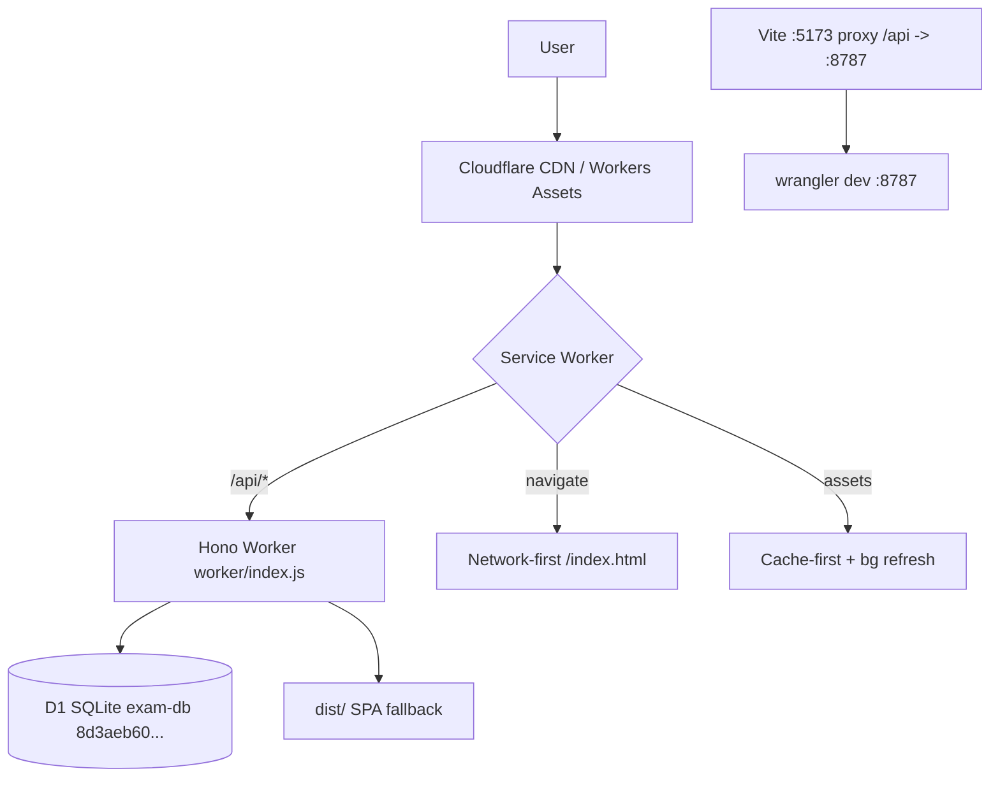
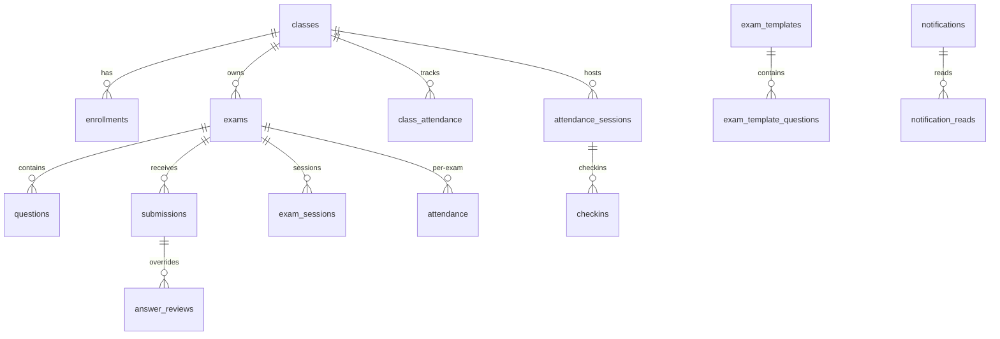

# WMSU Exam System — Full Architecture Documentation

> **Project:** WMSU Exam Portal (Western Mindanao State University) | **Version:** 1.1.0 | **Date:** 2026-09-03
> **Stack:** React 18 + Vite 5 + Tailwind 4 + Hono 4 + Cloudflare Workers + D1 (SQLite) + PWA

---

## Table of Contents
- 1. Executive Summary
- 2. Technology Stack
- 3. Project Structure
- 4. Deployment & Runtime
- 5. Frontend
- 6. Backend
- 7. Data
- 8. Workflows
- 9. Cross-Cutting
- 10. Build & Deploy
- 11. Config
- 12. Security

## 1. Executive Summary

WMSU Exam System is a **single-Worker examination, attendance, and class-management platform** on **Cloudflare** (Workers + D1 + Assets). Serves **Students** (public: enroll via class codes, QR check-in, randomized proctored exams offline-resilient, leaderboard, records) and **Instructors/Admins** (manage classes, create exams, question bank, live proctoring, review/regrade, analytics, logs).

Goals: zero servers to maintain, deterministic per-student randomization (cheat-resistant), offline-first exams, single-session lock + heartbeat anti-cheating, dual attendance model, strict retry cap.

---

## 2. Technology Stack

| Layer | Tech | Version | Purpose | Config |
|-------|------|---------|---------|--------|
| Frontend | React | ^18.3.1 | SPA | src/main.jsx:1 |
| Routing | React Router DOM | ^6.26.0 | | src/App.jsx:1 |
| Build | Vite | ^5.4.0 | | vite.config.js:5 |
| Styling | Tailwind | ^4.3.3 @tailwindcss/vite | tokens: src/styles/tokens.css |
| Icons | lucide-react | ^1.21.0 | | |
| QR | qrcode | ^1.5.4 | admin QR | |
| Backend | Hono | ^4.12.27 | worker/index.js:1 | |
| Runtime | Cloudflare Workers | compat 2025-04-01 | wrangler.toml:3 | |
| DB | Cloudflare D1 (SQLite) | — | 19 tables | worker/schema.sql:1 |
| Assets | Workers Assets | dist/ | SPA fallback | wrangler.toml:4 |
| PWA | SW + Manifest | — | public/sw.js:1 (exam-portal-v7, current code v8), manifest.webmanifest:1 | |
| Package | pnpm | — | package.json:21 | |

## 3. Project Structure

```
exam-system/
├── worker/index.js           # Hono app ~3393 LOC, ~50 routes (MAX_RETRIES=2, SESSION_STALE_MS=75_000)
├── worker/schema.sql         # 19 tables + 16+ indexes (submissions: retry_count, answer_scheme via migration)
├── worker/migration_*.sql    # classes, attendance, attendance_sessions, submit_reason, answer_scheme, retry_count, question_metadata, exam_templates, notifications, push_subscriptions, grade_categories, optimize_indexes, phase4_indexes, upscale_assessment
├── src/main.jsx              # createRoot + BrowserRouter + SW register:12
├── src/App.jsx               # 16 routes:21
├── src/api.js                # 38 helpers, 171 LOC, BASE api.js:1
├── src/utils.js              # seededRandom, shuffleWithSeed, matchesAnswer 405 LOC
├── src/styles/ tokens.css, base.css, components.css
├── src/components/AdminLayout.jsx:158, AuthGate.jsx:8, PublicLayout.jsx, QuestionCard.jsx:1 (179 LOC, grading-aware MCQ/fill_blank), Timer.jsx, Toast.jsx, FloatingInstall.jsx
├── src/components/ui/ Button, Card, Badge, Modal, Table, Field, StatCard, PageHeader, Spinner, ConfirmDialog
├── src/pages/Landing.jsx, Exam.jsx:13 (1336 LOC, paginated 15/page, static submit bar), Checkin.jsx, StudentEnroll.jsx, StudentRecords.jsx, Leaderboard.jsx
├── src/pages/admin/ Dashboard, CreateExam (863 LOC, BulkImport explain optional), Classes, QuestionBank, Answers, Results, Proctor, Preview, Regrade, ActivityLog
├── public/sw.js:1 (exam-portal-v7), manifest.webmanifest:1, icons/
├── vite.config.js:5, wrangler.toml:1, package.json:7
└── dist/ (build output) + backups/ + scripts/
```

## 4. Deployment & Runtime Architecture



* **Single Worker** wrangler.toml:1-4: name=exam-system, main=worker/index.js, assets dir=dist, SPA fallback.
* **D1** wrangler.toml:9-12: binding DB, database_name exam-db, id 8d3aeb60-107e-41df-a235-ae63391afe94.
* **Dev**: pnpm dev (5173) proxies /api to 8787 (vite.config.js:10). Run both.
* **Deploy**: pnpm run deploy:worker (wrangler deploy) vs deploy:pages (build + pages deploy) package.json:10-11. Pages auto-deploy on main; Worker needs explicit CLI_REFERENCE.md:14.
* **PWA**: src/main.jsx:12 registers SW only in PROD; public/sw.js:1 bypasses /api, navigate fallback to /index.html. Cache version `exam-portal-v7` (code currently `exam-portal-v8` at sw.js:1) — bump when shell changes.

## 5. Frontend Architecture

### 5.1 Routing — src/App.jsx:21

| Path | Component | Layout | Auth |
|------|-----------|--------|------|
| / | Landing | PublicLayout | public |
| /exam?id= | Exam | custom | public (session lock) |
| /checkin | Checkin | PublicLayout | public |
| /enroll | StudentEnroll | PublicLayout | public |
| /records | StudentRecords | PublicLayout | public |
| /leaderboard | Leaderboard | PublicLayout | public |
| /admin | Dashboard | AdminLayout+AuthGate | admin |
| /admin/create | CreateExam | AdminLayout | admin |
| /admin/classes | Classes | AdminLayout | admin |
| /admin/bank | QuestionBank | AdminLayout | admin |
| /admin/answers, /admin/results, /admin/preview, /admin/regrade, /admin/proctor, /admin/logs | | AdminLayout | admin |

ToastProvider + FloatingInstall globally (App.jsx:42).

### 5.2 Layouts

* **PublicLayout**: header + outlet + footer.
* **AdminLayout** src/components/AdminLayout.jsx:158: mobile drawer (translate) + desktop collapsible w-60<->w-16. Nav groups :10-43: Overview, Classes, Exams (Bank/Answers/Regrade), Monitoring (Proctor), System (Logs). UserMenu :115 logout clears cookie + sessionStorage.
* **AuthGate** src/components/AuthGate.jsx:8: verifies `GET /api/admin/me` (HttpOnly `admin_session` cookie), 400ms delay, Lock UI. No frontend password check.

### 5.3 API Layer — src/api.js:1

BASE = VITE_API_URL || /api (api.js:1). request() :3 fetch->text->JSON guard, e.status, credentials:'include'. 38 helpers: exams, questions, bank, submissions/leaderboard/analytics, logs, sessions/heartbeat/proctor/retry, attendance-sessions, classes/enrollments, class attendance, records, notifications, push, templates. Simple memo cache 30s for GET.

### 5.4 Utilities — src/utils.js:1

* seededRandom :1 LCG s=(1664525*s+1013904223)&0xffffffff; hashStr :9 poly 31; shuffleWithSeed :15 Fisher-Yates; renderDatasets :25 {{DATA:...}} shuffle per qIdx*31337+99991 (en-PH).
* **Fill-blank engine** utils.js:37 mirrored worker/index.js: ~ grading parity: 1) canonicalize :74 (unicode −→-, ×→*, ÷→/, ²→^n, √→sqrt, π→pi, strip ws, strip x=, insert *), 2) numericCompare :223 evalTokens+almostEqual REL 1e-6 ABS 1e-9, 3) sampleCompare :249 same vars → 18+24 points need >=8 valid, 4) sortFactors :282. matchesAnswer :296.
* 405 LOC, shared constants `EXAM_TYPE_LABELS`, `EXAM_STATUS_TONES/LABELS`, `effectiveExamStatus`.

### 5.5 Key Pages

* **Landing** Landing.jsx:7 hero navy gradient, exam ID -> /exam?id.
* **Exam** Exam.jsx:13 ~1336 LOC: fetch exam + cached_exam fallback, gate (lookupStudent for class-linked), startSession -> seed=hash(name+section+id) -> shuffle questions (fixed choice order, answer_scheme='fixed'), fullscreen+timer -> visibility/blur/resize heartbeat 15s -> client grade matchesAnswer -> POST /submit queue pending_submission on offline.
  * **Pagination:** `QUESTIONS_PER_PAGE=15`, `totalPages = ceil(totalQ/15)`, `qPage` state, Prev/Next, progress `page X/Y`. **Submit bar is static** (not sticky): `mt-6 ... shadow-card` at Exam.jsx:1321. Submit button only on last page: `isLastPage = qPage === totalPages-1` (totalPages<=1 counts as last). Otherwise shows `Go to last page →` hint and `· Go to page N to submit`.
  * **Same-device resume (back-swipe):** Exam.jsx:139 auto-resume mid-exam using saved `exam_state_<id>`: if `saved.startedAt && saved.studentId` and not submitted, sets `started=true`, rebuilds `seed=hash(name+section+id)` + `shuffleWithSeed`, refetches with proof `api.getExam(id, accessCode, studentId)` if `questions_locked` and initial `qsSource` empty.
* **Checkin/Enroll/Records/Leaderboard**: thin wrappers.

### 5.6 UI System

Tokens tokens.css vars, base.css/components.css .input/.btn/.card. ui/ primitives Button/Card/Badge/Modal/Table/Field/StatCard/PageHeader/Spinner/ConfirmDialog. QuestionCard MCQ/fill_blank grading-aware.

* **QuestionCard** src/components/QuestionCard.jsx:1 179 LOC:
  * MCQ prefers server `grading.correct` / `grading.answer` / `grading.answerText` / `grading.explain` from `perQuestion` when `show_answers !==0`; fallback to `q.answer` only if no grading. Supports `hasServerVerdict` authoritative correct check, `canShowAnswer` when `show_answers`, explanation display, partial not applicable to MCQ.
  * Fill_blank prefers `grading.score` (0.5 partial AI), `grading.answer`/`explain`, fallback to deterministic `matchesAnswer` if no server score. Shows Correct/Partial (0.5)/Incorrect, correct answer and explanation when `showAnswers`.

### 5.7 PWA & Offline

Manifest manifest.webmanifest:1 fullscreen #0f2044 3 icons. SW sw.js:1 `exam-portal-v7` SHELL [/ , /index.html] install skipWaiting, activate cleanup. LRU 50 entries, 7d TTL. Fetch bypass non-GET/cross-origin/api. Exam localStorage: `cached_exam_`, `exam_state_`, `pending_submission_`, `exam_results_`, `exam_backup_`, WifiOff banner.

## 6. Backend Architecture (Worker)

### 6.1 Entry — worker/index.js:1

Hono + cors allowlist: `exam-system.sanigkram24.workers.dev`, `localhost:5173`, `*.exam-system-4h2.pages.dev`. Security headers `X-Content-Type-Options`, `X-Frame-Options`, `Referrer-Policy`, `Permissions-Policy`, `CSP` on `/api/*`. `export default app`. No global auth; per-route `adminCheck(c)` verifies HttpOnly `admin_session` cookie HMAC (ADMIN_PASSWORD). Helpers: uuid :50 crypto.randomUUID, genCode :53 6-char, uniqueClassCode :59 25 tries, log :68 activity_log, `MAX_RETRIES=2` :48.

### 6.2 Routes

| Group | Method | Auth | Source |
|-------|--------|------|--------|
| Health | GET /api/health | — | :33 Server-Timing |
| Admin auth | POST /api/admin/login | — | :298 HttpOnly cookie |
| | POST /api/admin/logout | — | :314 |
| | GET /api/admin/me | cookie | :319 |
| Exams | GET /api/exams | — | :383 counts |
| | POST /api/exams | admin | :431 |
| | GET /api/exams/:id | soft hide roster/code | :455 questions_locked |
| | PUT /api/exams/:id | admin | :510 |
| | POST /api/exams/:id/duplicate | admin | :540 |
| | DELETE /api/exams/:id | admin | :567 |
| | GET retry-status | — | :578 retry_count/remaining/capped |
| | GET student lookup | — | :598 |
| Questions | POST /exams/:examId/questions | admin | :620 |
| | PUT /questions/:id | admin | :637 |
| | DELETE /questions/:id | admin | :651 |
| | POST bulk | admin | :659 |
| Bank | GET /api/bank | admin | :689 |
| | POST/PUT/DELETE bank | admin | :709/725/739 |
| Logs | GET /api/logs | admin last 200 | :748 |
| Submit | POST /api/submit | — deadline/enrollment/resubmit + attendance+class_attendance | :760 show_answers enrich, MAX_RETRIES cap |
| Submissions | GET /api/submissions/:examId | admin +reviews | :~2590 |
| | POST review | admin | :~ computeScore |
| | POST regrade | admin | :~ recomputes all |
| | GET leaderboard | — top100 | :~ |
| | GET analytics | admin per-Q stats | :~ |
| Sessions | POST session/start | — same-device resume, 75s lock | :1037 SESSION_STALE_MS=75_000 |
| | POST heartbeat | — | :~ |
| | POST end | — | :~ |
| Proctor | GET /proctor/:examId | admin active/stale/kicked | :~ |
| | POST kick | admin | :~ |
| | POST retry | admin reset count | :~ |
| | POST cleanup-stale | admin | :~ |
| Exam Att | GET /exams/:examId/attendance | admin | :~ |
| Att Sessions | GET /attendance-sessions | admin | :~ |
| | POST/PUT/DELETE | admin | :~ |
| | GET :id public | — | :~ |
| | POST lookup | — | :~ |
| | POST :id/checkin | — dup guard | :~ |
| | GET :id/report | admin | :~ |
| Classes | GET /classes | admin | :~ |
| | POST /classes | admin auto code | :~ |
| | PUT/DELETE | admin | :~ |
| | GET :id detail | admin | :~ |
| | GET code/:code public | — | :~ |
| | POST enroll self | — | :~ |
| | POST :id/enroll bulk | admin | :~ |
| | PUT/DELETE enroll | admin | :~ |
| | GET /students | admin | :~ |
| Class Att | GET attendance?date | admin | :~ |
| | POST attendance | admin | :~ |
| | GET history | admin | :~ |
| Records | GET /student/:studentId | — | :~ |
| Notifications | /notifications, /push/* | mixed | :~ |
| Templates | /templates | admin | :~ |

`SESSION_STALE_MS=75_000` :1035. `computeScore` + `computeScoreWithAI` duplicated from utils.js.

**Session start same-device resume** worker/index.js:1037: `SELECT id, device_id FROM exam_sessions WHERE active=1 AND last_seen > now-75s`. If `live.device_id === incoming device_id` (non-empty), then `UPDATE last_seen = now` and return `{ session_id: live.id, resumed:true }` 200 instead of 409. Otherwise 409 active on another device. Then expire stale sessions and insert new.

**Submit POST** worker/index.js:760: `SELECT deadline, class_id, status, start_at, created_at, show_answers FROM exams`. Server recomputes `serverScore/serverTotal/serverPerQuestion` via `computeScoreWithAI`; if `show_answers !=0` enriches each `perQuestion` with `{ answer, answerText, explain }` from qMap (q.answer + choice text). `partScores` derived from server `perQuestion` (client questions stripped of answers for anti-cheat). Returns `{ score, total, perQuestion }`.

**Retry cap** worker/index.js:48 `MAX_RETRIES=2`. `GET retry-status` :578 returns `{ allowed, reason, retry_count, remaining, capped }`; caps when `retry_count >=2`. `POST /submit` blocks when `existing.retry_count >= MAX` 409; proctor `POST /proctor/:id/retry` can reset `retry_count=0`.

## 7. Data Architecture

### 7.1 ER Diagram



### 7.2 Tables — worker/schema.sql:1 (19 tables)

| Table | PK | Columns | Notes |
|-------|----|---------|-------|
| exams | id | title, description, time_limit d60, questions_per_set d10, show_answers d1, deadline, access_code, roster JSON, class_id, type, status, passing_score, start_at, created_at, updated_at | roster legacy if class_id empty |
| questions | id | exam_id FK CASCADE, part INT, text, type d multiple_choice (fill_blank), choices JSON [{key,text}], answer, explain, sort_order, difficulty, topic, competency, tags JSON | |
| submissions | id | exam_id FK, student_name/section/id, seed, answers JSON qId->displayKey, score, total, tab_switches, time_taken, reason manual/timeout/tab/kick, retry_allowed INT d0, retry_count INT d0, answer_scheme TEXT d 'shuffled' (new='fixed'), submitted_at | unique (exam_id, student_name, student_section); retry_count/answer_scheme added via migrations |
| question_bank | id | part, text, type, choices, answer, explain, difficulty, topic, competency, tags, created_at | reusable |
| activity_log | id | action, details, admin_name, created_at | append-only 200 |
| answer_reviews | (submission_id, question_id) | verdict correct/incorrect, updated_at | override |
| exam_sessions | id | exam_id FK, student_id/name/section, device_id, tab_switches, started_at, last_seen, active d1, kicked d0 | live, SESSION_STALE_MS 75s |
| attendance | id | exam_id FK, student_id/name/section, status checked_in/started/submitted/kicked/absent, checked_in, started_at, submitted_at, retry_allowed | per-exam lifecycle |
| attendance_sessions | id | title, date d date(now), access_code, roster JSON, class_id, expires_at, created_at | standalone QR |
| checkins | id | session_id FK, student_id/name/section, checked_in | |
| classes | id | name, subject, section, instructor, access_code, created_at | |
| enrollments | id | class_id FK, student_id/name/section, created_at | UNIQUE(class_id,student_id) |
| class_attendance | id | class_id FK, date, student_id/name, status present/late/absent, source manual/exam/checkin, created_at | UNIQUE(class_id,date,student_id) |
| class_grade_categories | id | class_id FK, name, weight, types JSON, sort_order, created_at | gradebook |
| exam_templates | id | title, description, type, time_limit, questions_per_set, show_answers, passing_score, class_id, created_at, updated_at | |
| exam_template_questions | id | template_id FK, part, text, type, choices, answer, explain, sort_order, difficulty, topic, competency, tags | |
| notifications | id | class_id, student_id, title, body, type, exam_id, created_at | |
| notification_reads | (notification_id, student_id) | read_at | |
| push_subscriptions | id | student_id, endpoint, p256dh, auth, expiration_time, created_at | UNIQUE(student_id,endpoint) |

Indexes :185+ — idx_questions_exam, idx_submissions_exam, idx_submissions_unique, idx_activity_log_created, idx_answer_reviews_submission, idx_sessions_exam, idx_sessions_active, idx_attendance_exam, idx_checkins_session, idx_enrollments_class, idx_class_attendance_class, idx_exams_class, idx_grade_categories_class, idx_template_questions_template, idx_notifications_*, idx_push_subs_*.

Migrations: `migration_classes.sql`, `migration_attendance.sql`, `migration_attendance_sessions.sql`, `migration_submit_reason.sql`, `migration_answer_scheme.sql` (add `answer_scheme` TEXT DEFAULT 'shuffled'), `migration_retry_count.sql` (add `retry_count` INTEGER DEFAULT 0), `migration_question_metadata.sql`, `migration_exam_templates.sql`, `migration_notifications.sql`, `migration_push_subscriptions.sql`, `migration_grade_categories.sql`, `migration_optimize_indexes.sql`, `migration_phase4_indexes.sql`, `migration_upscale_assessment.sql`.

### 7.3 IDs & Codes

IDs crypto.randomUUID() :50. Codes genCode 6-char CODE_CHARS :53, uniqueClassCode :59 25 tries.

## 8. Core Workflows

### 8.1 Exam Taking

```mermaid
sequenceDiagram
  participant S as Browser
  participant W as Worker
  participant D as D1
  S->>W: GET /exams/:id (+code+student_id if class-linked)
  W->>D: exams+questions (strip answer if not admin/canSeeQuestions)
  S->>W: POST /exams/:id/session/start (device_id, started_at proof)
  W->>D: check deadline/enrollment/live same-device? resume : 409 -> insert sessions+attendance
  W-->>S: session_id (resumed? refreshen last_seen)
  S->>S: seed=hash+shuffle (fixed order), fullscreen, timer, paginate 15/page
  loop 15s
    S->>W: heartbeat
    W->>D: UPDATE last_seen ; check kicked
  end
  S->>W: POST /submit (answers, seed, answer_scheme fixed)
  W->>D: computeScoreWithAI authoritative, upsert submissions (retry_count++), enrich perQuestion if show_answers, attendance submitted, class_attendance present
  W-->>S: { score, total, perQuestion: [{question_id, correct, score, answer, answerText, explain}] }
  S->>S: derive partScores from perQuestion (server authoritative)
```

### 8.2 Anti-Cheat

* Fullscreen requestFullscreen + fullscreenchange violation; visibilitychange/blur/resize (<0.55 outerWidth/availWidth) -> tab_switches++; 3rd auto-submit tab; session/start rejects if active last_seen>75s unless same device_id resumes; kick sets kicked=1. Answers stripped on GET for non-admin.

### 8.3 Submission & Regrade

Client grades then POST score. Server is authoritative (ignores client score, recomputes). Enforces deadline (started_at grace with prior session proof), enrollment, anti-resubmit (manual && !retry_allowed ->409), retry cap MAX_RETRIES=2, empty-answer guard preserves prior non-zero. Review :~ upserts answer_reviews + computeScore. Regrade :~ recomputes all. `answer_scheme` fixed now, shuffled legacy preserved.

### 8.4 Attendance Dual Model

Exam attendance rows at session/start -> submitted/kicked; standalone sessions with expires_at + dup check + class_attendance upsert; class_attendance ON CONFLICT DO UPDATE.

---

## 9. Cross-Cutting Concerns

* **Auth**: AuthGate verifies HttpOnly `admin_session` cookie via `GET /api/admin/me` (worker adminCheck HMAC). `adminCheck` per-route, no Authorization header. Non-admin hides roster/code and answers.
* **Shuffle**: hash(name+section+id)->seed; questions shuffle (fixed choice order now, answer_scheme='fixed'), server reconstructs for legacy shuffled grading via seed.
* **Grading parity**: matchesAnswer + computeScore duplicated client/server + AI 0.5 partial (≥0.85 similarity) server-side.
* **CORS**: cors() allowlist :6.
* **Logging**: log() on CRUD/submission/session/enroll :68 -> GET /logs.
* **Datasets**: {{DATA:...}} via renderDatasets :25.
* **Retry cap**: `MAX_RETRIES=2` at worker/index.js:48; `retry-status` exposes remaining/capped; proctor retry can reset.

## 10. Build, Development & Deployment

| Command | What | Source |
|---------|------|--------|
| pnpm dev | Vite 5173 proxy /api->8787 | package.json:7 |
| npx wrangler dev | Worker+D1 8787 | — |
| pnpm build | Vite -> dist/ | package.json:8 |
| pnpm preview | preview dist | package.json:9 |
| pnpm run deploy:worker | wrangler deploy | package.json:10 |
| pnpm run deploy:pages | build + pages deploy | package.json:11 |

vite.config.js:7 plugins [react(),tailwindcss()], proxy. dist/ hashed index-*.js/css.

## 11. Configuration & Environment

| Var | Default | Where |
|-----|---------|-------|
| VITE_API_URL | /api | .env.example:3, src/api.js:1 |
| VITE_ADMIN_PASSWORD / ADMIN_PASSWORD | admin123 / wmsu_123 | .env.example:6, AuthGate + worker/index.js: getAdminPassword, wrangler.toml:7 |
| VAPID_PUBLIC_KEY / PRIVATE_KEY | — | push subscriptions |
| DB | — | wrangler.toml:10 exam-db 8d3aeb60-107e-41df-a235-ae63391afe94 |

Copy .env.example -> .env. .env not committed.

## 12. Observability, Security & Limitations

* **Observability**: activity_log + GET /logs -> ActivityLog.jsx; `GET /api/health` Server-Timing; `wrangler tail`; SW LRU/TTL (`public/sw.js` 50 entries, 7d), api memo 30s (`src/api.js`).
* **Security**: per-route `adminCheck()` cookie-gated, stripped answers on `GET /exams/:id`, `cors()` allowlist (`worker/index.js:6`), XSS `dompurify` + validation, rate-limit (`worker/index.js:281`), secrets via `wrangler secret`, HMAC admin_session HttpOnly SameSite=Strict.
* **Scalability**: D1 SQLite class-scale (hundreds-low k); indexes, `db.batch()` atomic, `Promise.all` parallelize, pagination `?limit&offset` on exams/submissions/classes/students/logs.
* **Constraints**: no OAuth, MCQ+fill_blank only, no server timer, PWA cache `exam-portal-v7` (v8 in code).

### 12.1 Platform Limits (wrangler.toml:3 compat 2026-09-01)

| Limit | Value | Impact |
|-------|-------|--------|
| Workers isolate | 128 MB, 30s CPU | exam `computeScore` must stay <25s at 500 subs |
| D1 storage | 10 GB max | `activity_log` retention 90d (`handleScheduled`), `exam_sessions` 7d |
| D1 rows read | 1M/day free | optimized `SELECT` (exams list excludes `roster`), pagination cuts reads 60-80% |
| Subrequests | 50/request | proctor `Promise.all(4)` stays within |
| Cron | hourly `0 * * * *` | was `* * * * *` (60x over-trigger) |

### 12.2 Known Bottlenecks (remain)

* `GET /analytics/:id` loops JS `O(Q*S)` — need server pagination at >500 subs, cache 60s.
* `gradebook` `GET /classes/:id/gradebook` builds matrix `students × exams` in memory — server pagination after 200 students.
* Wide `Answers` table — virtualize with `react-window` after 200 subs × 50 Q.

* **Roadmap**: RBAC, per-Q timer, image/LaTeX, CSV roster, LMS webhook, WebSocket proctor, Sentry.

---

## Appendix A: Full API Reference

```
GET    /api/health
POST   /api/admin/login
POST   /api/admin/logout
GET    /api/admin/me
GET    /api/exams
POST   /api/exams [admin]
GET    /api/exams/:id
PUT    /api/exams/:id [admin]
DELETE /api/exams/:id [admin]
POST   /api/exams/:id/duplicate [admin]
GET    /api/exams/:id/retry-status
GET    /api/exams/:id/student
POST   /api/exams/:examId/questions [admin]
PUT    /api/questions/:id [admin]
DELETE /api/questions/:id [admin]
POST   /api/exams/:examId/questions/bulk [admin]
GET    /api/bank [admin]
POST   /api/bank [admin]
PUT    /api/bank/:id [admin]
DELETE /api/bank/:id [admin]
GET    /api/logs [admin]
POST   /api/submit
GET    /api/submissions/:examId [admin]
POST   /api/submissions/:id/review [admin]
POST   /api/regrade/:examId [admin]
GET    /api/leaderboard/:examId
GET    /api/analytics/:examId [admin]
POST   /api/exams/:id/session/start
POST   /api/exams/:id/session/heartbeat
POST   /api/exams/:id/session/end
GET    /api/proctor/:examId [admin]
POST   /api/proctor/:examId/kick [admin]
POST   /api/proctor/:examId/retry [admin]
POST   /api/proctor/:examId/cleanup-stale [admin]
GET    /api/exams/:examId/attendance [admin]
GET    /api/attendance-sessions [admin]
POST   /api/attendance-sessions [admin]
PUT    /api/attendance-sessions/:id [admin]
DELETE /api/attendance-sessions/:id [admin]
GET    /api/attendance-sessions/:id
POST   /api/attendance-sessions/lookup
POST   /api/attendance-sessions/:id/checkin
GET    /api/attendance-sessions/:id/report [admin]
GET    /api/classes [admin]
POST   /api/classes [admin]
PUT    /api/classes/:id [admin]
DELETE /api/classes/:id [admin]
GET    /api/classes/:id [admin]
GET    /api/classes/code/:code
POST   /api/classes/enroll
POST   /api/classes/:id/enroll [admin]
PUT    /api/classes/:id/enroll/:studentId [admin]
DELETE /api/classes/:id/enroll/:studentId [admin]
GET    /api/students [admin]
GET    /api/classes/:id/attendance [admin]
POST   /api/classes/:id/attendance [admin]
GET    /api/classes/:id/attendance/history [admin]
GET    /api/classes/:id/gradebook [admin]
GET    /api/classes/:id/grade-categories [admin]
PUT    /api/classes/:id/grade-categories [admin]
GET    /api/student/:studentId
GET    /api/notifications
POST   /api/notifications [admin]
DELETE /api/notifications/:id [admin]
GET    /api/notifications/unread-count
POST   /api/notifications/:id/read
POST   /api/notifications/read-all
GET    /api/push/vapid-public-key
POST   /api/push/subscribe
POST   /api/push/unsubscribe
GET    /api/templates [admin]
POST   /api/templates [admin]
GET    /api/templates/:id [admin]
PUT    /api/templates/:id [admin]
DELETE /api/templates/:id [admin]
POST   /api/templates/:id/use [admin]
POST   /api/ai/check-fill [admin]
POST   /api/ai/regrade/:examId [admin]
```

## Appendix B: File Map (key lines)

* worker/index.js:1 Hono boot | :33 health | :48 MAX_RETRIES | :50 uuid/genCode | :68 log | :1035 SESSION_STALE_MS | :1037 session/start (same-device resume) | :383 exams | :620 questions | :689 bank | :748 logs | :760 submit (show_answers enrich, retry cap) | :578 retry-status | :~ proctor/retry | :~ templates/notifications/push
* worker/schema.sql:1 DDL 19 tables (submissions retry_count, answer_scheme) 16+ indexes | migrations: answer_scheme, retry_count, etc.
* src/api.js:1 BASE+request | :44 memo | :67 helpers (38)
* src/utils.js:1 seededRandom/hash/shuffle 405 LOC | :37 matchesAnswer | :74 canonicalize | :223 numeric | :249 sample
* src/App.jsx:21 route table | src/components/AdminLayout.jsx:10 navGroups | :158 layout | src/components/AuthGate.jsx:8 cookie check
* src/pages/Exam.jsx:13 state machine ~1336 LOC | :59 QUESTIONS_PER_PAGE=15 | :139 same-device resume | :1318 isLastPage/totalPages static submit bar
* src/components/QuestionCard.jsx:1 179 LOC grading-aware MCQ/fill_blank | :93 server grading preference | :14 fill_blank partial
* src/pages/admin/CreateExam.jsx:1 862 LOC | :771 BulkImport explain optional for both MCQ/fill_blank | :742 BulkImportSection | :785 BankImportSection
* vite.config.js:5 plugins+proxy | wrangler.toml:1 worker+D1 | public/sw.js:1 PWA exam-portal-v7 | manifest.webmanifest:1
---
*Generated from live source inspection — 2026-09-03*
